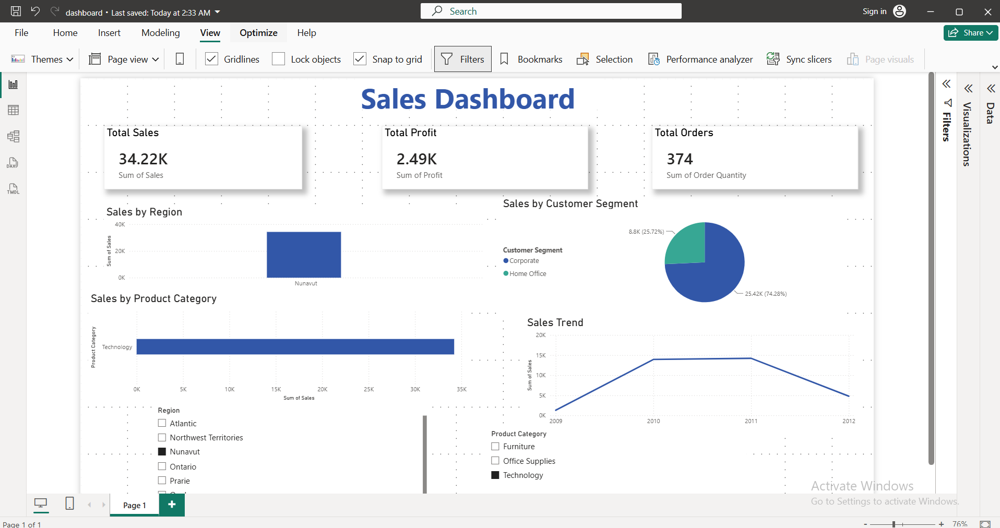

# Sales Dashboard using Power BI

## 📌 Project Overview

This project is an interactive Power BI dashboard designed to analyze sales performance using key business metrics. It provides insights into sales, profit, customer segments, product categories, and yearly sales trends through interactive visualizations.

## 📊 Dashboard Features

- Total Sales KPI
- Total Profit KPI
- Total Orders KPI
- Sales by Region
- Sales by Product Category
- Customer Segment Analysis
- Sales Trend Over Time
- Interactive Filters (Region & Product Category)

## 🔍 Key Insights

- Analyze sales performance across different regions.
- Compare product categories based on total sales.
- Explore customer segment distribution.
- Monitor sales trends over time.
- Filter dashboard results interactively.

## 🛠️ Tools & Technologies

- Microsoft Power BI Desktop
- Microsoft Excel
- Data Visualization
- Business Intelligence

## 📁 Repository Contents

- dashboard.pbix – Power BI dashboard file.
- Sample - Superstore Sales (Excel).xlsx – Dataset used for analysis.
- db.png – Dashboard preview image.
- README.md – Project documentation.

## 🚀 How to Use

1. Download or clone this repository.
2. Open the .pbix file using Microsoft Power BI Desktop.
3. Refresh the data if needed.
4. Explore the dashboard using the interactive filters.
